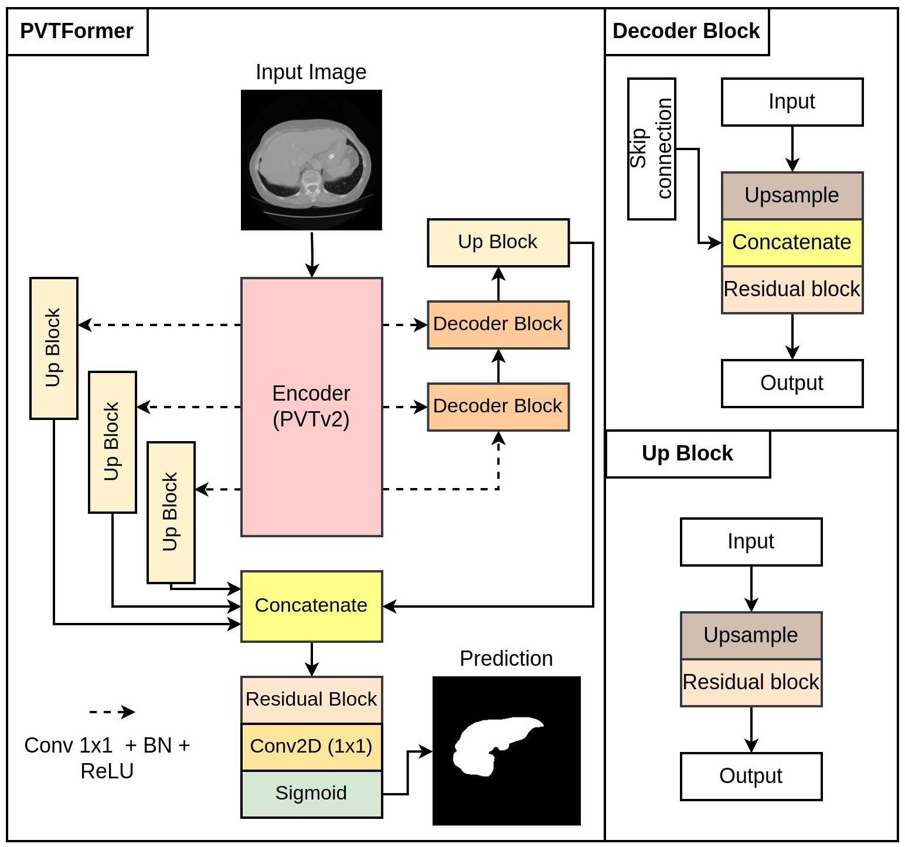
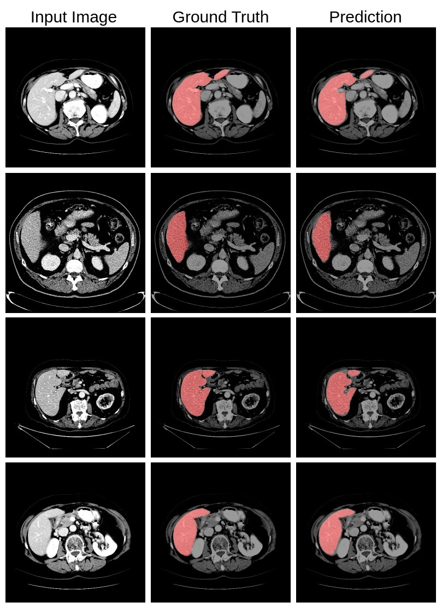
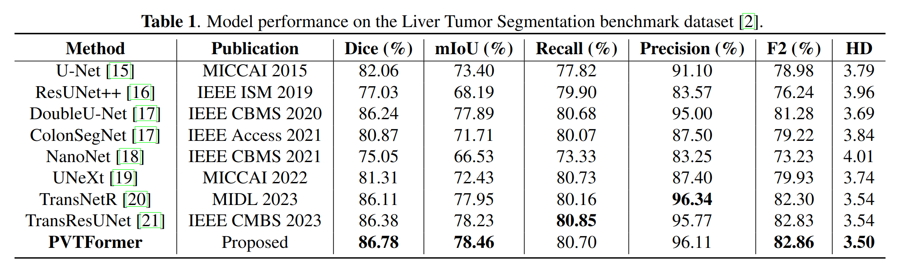

# CT Liver Segmentation Via PVT-based Encoding and Refined Decoding

## Overview
PVTFormer is a novel encoder-decoder framework designed for precise liver segmentation from CT scans. At its core, it utilizes the Pyramid Vision Transformer (PVT v2) as a pretrained encoder, enhancing the segmentation process with its unique ability to handle variable-resolution input images and produce multi-scale representations. Our approach includes a novel hierarchical decoding strategy that incorporates specialized upscaling in the Up block with effective multi-scale feature fusion in the Decoder. This approach significantly enhances the network's ability to delineate detailed semantic features, which is vital for precise liver segmentation.

## Key Features
-**Encoder-Decoder Framework:** Incorporates PVT v2 for efficient and rich feature extraction.

-**Hierarchical Decoding Strategy:** Enhances semantic features for high-quality segmentation masks.

-**Efficient Feature Processing:** Combines residual learning with Transformer mechanisms for optimal feature representation.

-**High Performance Metrics:** Achieves impressive dice coefficients and mean IoUs, outperforming state-of-the-art methods.
## PVTFormer Architecture 

## Architecture Advantages:
- Improved accuracy for liver and other medical image segmentation.
- Efficient learning of hierarchical features.
- Ability to capture long-range spatial dependencies.

  
## Applications
PVTFormer is highly effective for healthy liver segmentation, with potential applications in other medical imaging areas. It represents a significant advancement in medical image segmentation, offering a robust solution for accurate diagnosis and treatment planning.

## Uses of PVTFormer:
- Medical Image Segmentation 
- General Image Segmentation
- Anomaly Detection in Medical Images 
- Comparative Studies

## Dataset 
LiTS dataset

## Results
 ***Qualitative results comparison of the SOTA methods***  

***Quantitative results comparison of the SOTA methods***  

## Citation
Please cite our paper if you find the work useful: 
<pre>
@inproceedings{jha2024ct,
  title={CT Liver Segmentation via PVT-based Encoding and Refined Decoding},
  author={Jha, Debesh and Tomar, Nikhil Kumar and Biswas, Koushik and Durak, Gorkem and Medetalibeyoglu, Alpay and Antalek, Matthew and Velichko, Yury and Ladner, Daniela and Borhani, Amir and Bagci, Ulas},
  bookarticle={Proceedings of the International Symposium on Biomedical Imaging (ISBI)},
  year={2024}
}
</pre>

## Contact
Please contact debesh.jha@northwestern.edu for any further questions.

